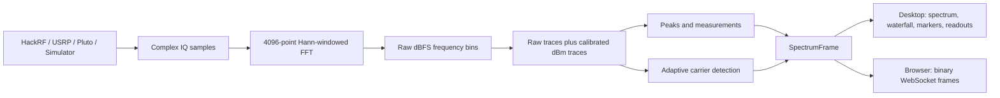

# SDR Frequency Analyzer

A desktop spectrum analyzer for receiving and displaying live RF signals with:

- HackRF One
- Ettus USRP devices supported by UHD
- Analog Devices ADALM-Pluto through SoapyPlutoSDR/libiio
- A built-in IQ simulator for testing without hardware

The application continuously receives complex IQ samples from the selected
source, calculates an FFT, and displays a live spectrum and waterfall. Existing
analysis features include clear/write, max hold, min hold, averaging, peak
measurements, markers, delta markers, occupied bandwidth, adaptive multi-carrier
detection, and CSV export. The same pipeline is also served to a browser console
through `run_web.py`.
A small, slow-blinking red marker automatically follows the strongest live FFT
bin. Six normal/delta markers can be attached to CW, Max hold, Min hold, or
Average, with one trace selected for all markers at a time. Marker selection
defaults to **None** so spectrum clicks cannot create markers accidentally.

> **Amplitude units:** when `power_offset_db` is configured for the selected
> device/serial, every trace, marker, waterfall, and measurement is displayed in
> calibrated dBm. An uncalibrated device remains visibly labeled dBFS. See
> [Amplitude: dBFS and dBm](#amplitude-dbfs-and-dbm).

## Contents

- [How the project works](#how-the-project-works)
- [Quick test without hardware](#quick-test-without-hardware)
- [Web browser version](#web-browser-version)
- [Installation](#installation)
- [Running with an SDR](#running-with-an-sdr)
- [Using the interface](#using-the-interface)
- [Measurements](#measurements)
- [Carrier detection](#carrier-detection)
- [Amplitude: dBFS and dBm](#amplitude-dbfs-and-dbm)
- [Calibration guide](calibration.md)
- [Project structure](#project-structure)
- [Testing](#testing)
- [Troubleshooting](#troubleshooting)
- [RF safety](#rf-safety)

## How the project works

The same processing pipeline is used for physical SDRs and the simulator.
Simulator mode generates IQ samples; it does not generate a ready-made graph.



In simple terms:

1. `backend/acquisition.py` finds the selected SDR through SoapySDR and opens a
   continuous receive stream. Simulator mode creates two nearby QPSK/OFDM-like
   occupied carriers with noise locally.
2. Acquisition runs on a background thread so the GUI stays responsive.
3. `backend/dsp.py` applies a Hann window and computes a 4096-point FFT. It
   converts FFT-bin magnitudes into dBFS and builds the frequency axis.
4. `backend/trace.py` updates the live, max-hold, min-hold, and average arrays.
5. `backend/measurements.py` and `backend/peak.py` calculate the measurement
   values. The renderer places the red auto-peak indicator on the strongest live
   FFT bin.
6. `backend/carrier_detection.py` estimates the noise floor from the live trace
   and returns the occupied carrier regions found in that frame. See
   [Carrier detection](#carrier-detection).
7. `backend/controller.py` retains the raw dBFS values, applies the selected
   device/serial calibration, and packages explicit dBFS and dBm fields plus the
   carrier list into one `SpectrumFrame`.
8. Qt sends that frame to the spectrum renderer and waterfall in the frontend.
   `webapp/server.py` sends the same frame to every connected browser through
   `webapp/protocol.py`.

The default FFT size is 4096. The approximate resolution bandwidth is:

```text
RBW = sample rate / 4096
```

For example, at 20 Msps, the RBW is approximately 4.883 kHz.

## Quick test without hardware

Only Python, NumPy, PyQt6, and pyqtgraph are needed for simulator mode.

From the repository root:

```powershell
python run.py
```

Then:

1. Leave **SIMULATOR** selected.
2. Press **Run**.
3. Two nearby digital-carrier bands and a noise floor should appear.
4. Enable **Max Hold**, **Min Hold**, and **Average**. The traces should separate
   because the simulated carrier levels change over time.
5. Choose a **Trace Marker** option, then click the spectrum to place a marker.
6. Enable **Delta** and drag the delta marker. Both markers remain snapped to the
   selected trace instead of moving freely.
7. Check the waterfall, measurements, screenshot, and CSV export.
8. Change center frequency, span, sample rate, or gain. The source is restarted
   with the new settings and trace history begins again.
9. Press **Stop** when finished.

## Web browser version

The web console uses the same Python acquisition, DSP, calibration, trace,
carrier, peak, and measurement pipeline as the desktop application. Spectrum
frames are sent to each browser as compact binary Float32 WebSocket messages;
raw IQ remains on the SDR host. Slow browsers automatically receive the newest
frame instead of building a delayed frame backlog.

Install the Python dependencies, then start a local-only server:

```powershell
python run_web.py
```

Open `http://127.0.0.1:8000` and press **Start acquisition**. Simulator mode
requires no SDR hardware.

To allow other computers on the same approved campus network:

```powershell
python run_web.py --host 0.0.0.0 --port 8000 --token "replace-with-a-long-random-token"
```

Users open `http://HOST-IP:8000` and enter that token. The host firewall and
campus network must permit the selected port. Use a static IP, DHCP reservation,
or campus DNS name so the address remains stable. Consult campus IT before
exposing the service outside a controlled lab VLAN; place an HTTPS reverse proxy
in front of it if traffic crosses an untrusted network.

One browser owns the control lease at a time so two users cannot retune the
single SDR simultaneously. Other connected browsers remain live viewers and can
explicitly take control. The web console includes the spectrum, waterfall,
traces, measurements, carrier overlays, six markers, delta markers, zoom/pan,
PNG capture, and calibrated raw/dBm CSV export. The desktop application remains
available through `python run.py`.

## Installation

### Required Python and GUI packages

| Package | Used for |
|---|---|
| Python 3.10 or newer | Application runtime |
| NumPy | IQ arrays, FFT, traces, and measurements |
| PyQt6 | Desktop interface and thread-safe signals |
| pyqtgraph | Spectrum, waterfall, traces, and markers |
| FastAPI and Uvicorn | Browser API, static UI, and campus web server |
| WebSockets | Low-latency binary spectrum delivery |

### Required SDR packages

| Package | Used for |
|---|---|
| SoapySDR with Python bindings | Common streaming and discovery interface |
| `soapysdr-module-hackrf` and `hackrf` | HackRF One |
| `soapysdr-module-uhd` and `uhd` | Ettus USRP |
| `soapysdr-module-plutosdr` and `libiio` | ADALM-Pluto |

The recommended environment is Radioconda. From a Radioconda Prompt:

```powershell
mamba install -c conda-forge -c ryanvolz numpy pyqt6 pyqtgraph soapysdr soapysdr-module-hackrf soapysdr-module-uhd soapysdr-module-plutosdr hackrf uhd libiio
```

Alternatively, create the supplied environment:

```powershell
mamba env create -f environment.yml
conda activate freqanalyzer
```

`requirements.txt` contains the Python-only packages. It is not sufficient for
physical SDRs because pip does not install all native device drivers and DLLs.

For Windows driver installation, UHD image setup, PATH configuration, and
offline ISRO deployment, read [INSTALL.md](INSTALL.md).

## Running with an SDR

Always start the program from an activated **Radioconda Prompt** in the project
root:

```powershell
cd C:\path\to\freqanalyzer
python run.py
```

Do not use `py main.py`. `py` may select a different Python installation, and
the application entry point is `run.py`.

### HackRF One

Verify the device before opening the application:

```powershell
hackrf_info
SoapySDRUtil --find="driver=hackrf"
```

Then:

1. Keep the signal-generator RF output off.
2. Connect the generator to the HackRF antenna SMA through suitable attenuation.
3. Run `python run.py`.
4. Select **HackRF**.
5. Set center frequency, span, sample rate, and a moderate starting gain.
6. Press **Run** and wait for the connected status.
7. Enable the signal generator at a safe low level.

Placing a CW tone slightly away from the exact center frequency is useful
because direct-conversion SDRs can show a DC artifact at the center bin.

### Ettus USRP

Before running the GUI:

```powershell
uhd_find_devices
uhd_usrp_probe
SoapySDRUtil --find="driver=uhd"
```

Run `uhd_images_downloader` during initial setup. USB USRPs require the correct
Windows USB driver. Network USRPs must be reachable on the configured network
interface and permitted by the local firewall.

Select **Ettus USRP X301** in the application to load the X300-series profile:
up to 200 MS/s and a 160 MHz span. Ettus documents the product as X300 (the
Kintex-7 325T model); this UI uses the requested X301 label for that profile.
The full 160 MHz span requires a compatible 160 MHz daughterboard plus 10 GigE
or PCIe. A 1 GigE link is limited to substantially lower streaming rates. The
analyzer discovers and opens the USRP only when acquisition starts and uses RX
channel 0. Switching back to **HackRF One** restores its 20 MS/s and 20 MHz
limits before the next stream opens.

### ADALM-Pluto

Verify USB or network discovery before opening the application:

```powershell
iio_info -s
SoapySDRUtil --find="driver=plutosdr"
```

Select **ADALM-Pluto** to use its dedicated receive path. The standard profile
limits tuning to 325 MHz–3.8 GHz, instantaneous span to 20 MHz, and sampling to
61.44 MS/s. Device selection supports both USB and network libiio URIs. Modified
out-of-spec Pluto firmware ranges are intentionally not assumed. The default is
4 MS/s and a 4 MHz span for reliable USB operation; higher exposed rates depend
on the host transport and may overflow.

## Using the interface

The header is reserved for device selection and acquisition state. Tuning and
receiver configuration live in **Analyzer Setup** on the left. The right-side
**Analysis** dock separates the remaining controls into **Measure**, **Traces**,
and **Markers** tabs so the spectrum and waterfall remain the visual focus. The
three tabs always share the full Analysis width equally. Edge-arrow handles hide
or restore either side dock; with both docks hidden, the central spectrum and
waterfall expand across the complete workspace. The interface uses a true black
background with high-contrast near-black panels, gray borders, white text, and
cyan interaction accents so controls and plot annotations remain visible.

### Device and receiver controls

| Control | Meaning |
|---|---|
| Device | Select Simulator, HackRF One, Ettus USRP X301, or ADALM-Pluto |
| Start / Stop acquisition | Open or close the continuous receive stream |
| Center | RF center frequency in Hz, kHz, MHz, or GHz |
| Span | Width of spectrum displayed around the center |
| SR | Hardware sample rate in mega-samples per second |
| Gain | Receiver gain requested through SoapySDR |

The displayed span cannot exceed the sample rate. If a smaller span is selected,
the backend crops the FFT bins around the center frequency. Changing a receiver
setting while running performs a controlled stream restart.

Device selection updates both the sample-rate choices and the span limit. The
HackRF profile restores 20 MS/s and 20 MHz. The X301 profile exposes 200 MS/s
and 160 MHz subject to its daughterboard and host-link requirements. The Pluto
profile exposes sample rates through 61.44 MS/s with a 20 MHz maximum span and
applies its standard tuning range. A device
can still reject a setting unsupported by its exact hardware configuration; the
status bar displays that error rather than silently continuing.

### Traces

| Trace | Color | Behavior |
|---|---|---|
| Clear Write | Cyan | Most recent FFT frame |
| Max Hold | Violet | Highest value reached by every frequency bin |
| Min Hold | Blue | Lowest valid displayed-sweep value reached by every frequency bin since Min Hold was enabled |
| Average | Yellow | Running linear-power average of every frequency bin, displayed in the active calibrated unit |

Max-hold and average history start with acquisition. Min hold starts fresh when
it is enabled. Trace history resets after the stream is reconfigured or
restarted. Numerical FFT-floor values are excluded from min hold so a single
underflow bin cannot pin the trace to -140 dBFS. Multiple traces can be displayed
at the same time. Average uses the same power-detector path for Simulator,
HackRF, USRP, and Pluto input, so noise-like digital modulation remains visible instead
of being suppressed by direct arithmetic averaging of dB values. Hardware modes
show only carriers physically present at their RF inputs; no simulator signal is
mixed into live SDR samples.

### Markers

- **None** is selected initially. While it is active, spectrum clicks, context
  placement, and Peak Search cannot create or move a normal marker.
- Select **CW**, **Max hold**, **Min hold**, or **Average** in **Trace Marker**.
  This one selection applies to all six normal markers and their delta markers.
- Select marker M1 through M6 and click the spectrum to place it. Changing
  **Trace Marker** reattaches all existing markers at their current frequencies.
- Edit a marker's **Freq** cell in the marker table to move it precisely. A plain
  number is interpreted as MHz; explicit `Hz`, `kHz`, `MHz`, and `GHz` suffixes
  are accepted. The marker snaps to the nearest displayed FFT bin.
- A normal marker snaps to the nearest FFT bin and follows that bin's value on
  the selected trace as new frames arrive.
- Delta mode creates a second marker relative to the selected normal marker.
- The delta marker also snaps to the selected trace while being dragged.
- Delta frequency and amplitude are shown relative to the parent marker.
- **Clear All** removes all normal and delta markers.
- A small red triangle automatically tracks the global live-spectrum peak and
  blinks every 700 ms. Red is reserved for this automatic indicator.

### Waterfall

The waterfall stores recent spectrum frames as rows. Frequency runs horizontally
and older frames move through the time axis. Color represents calibrated dBm
when available, with the same explicit dBFS fallback as the spectrum.

### Screenshot and CSV

- **Screenshot** saves an image of the application.
- **Export CSV** saves auditable raw `*_dbfs` columns and adds calibrated
  `*_dbm` columns when a power calibration is active.
- Exports default to `SpectrumAnalyzer_Exports` in the current user's home
  directory, but the file dialog allows another location.

### Keyboard shortcuts

| Shortcut | Action |
|---|---|
| Space | Run or stop acquisition |
| C | Toggle clear/write |
| Ctrl+H | Toggle max hold |
| Ctrl+L | Toggle min hold |
| Ctrl+G | Toggle average |
| Shift+M | Toggle delta marker |
| S | Screenshot |
| Ctrl+E | Export CSV |
| `+` / `-` | Zoom in / out |
| R | Reset zoom |
| Escape | Stop acquisition |

Right-clicking the spectrum also provides marker placement, marker clearing,
center-here, peak search, zoom, and screenshot actions.

## Measurements

The right-side measurement panel currently reports:

| Measurement | Current calculation |
|---|---|
| Peak Frequency | Frequency of the strongest live FFT bin |
| Peak Amplitude | Calibrated amplitude of that bin in dBm |
| Noise Floor | Median amplitude of all displayed FFT bins |
| Occupied Bandwidth | Frequency interval containing the middle 99% of displayed spectral power: 0.5% to 99.5% cumulative power |
| Channel Power | Sum of linear power from every displayed FFT bin, converted to calibrated dBm |

Important interpretation notes:

- Noise floor is a per-bin value and changes with sample rate, FFT size, RBW,
  window, and receiver gain.
- Occupied bandwidth includes displayed noise. A weak signal can therefore
  produce a large occupied-bandwidth value.
- Channel power currently integrates the complete displayed span; there is no
  separately selected channel boundary.

## Carrier detection

`backend/carrier_detection.py` runs on every frame and returns a list of
`CarrierRegion` objects. Both the desktop renderer and the browser console draw
them as shaded overlays; the **Carrier** button toggles the overlay without
stopping detection. The engine is frequency-domain, single-frame, and does not
require prior knowledge of the transponder plan.

### Stages

1. **Smoothing.** An edge-padded moving average produces the core trace. The
   window defaults to `2 * round(bins / 1024) + 1`, forced odd and clamped to
   3-11 bins. Edge padding is required for dB data: `np.convolve(mode="same")`
   would insert 0 dB outside the FFT and manufacture large false peaks beside a
   -70 to -100 dBFS receiver floor.
2. **Noise statistics.** The floor is the median of all bins at or below the
   60th percentile, which excludes occupied bins from the estimate. Roughness is
   a first-difference MAD, `sigma = 1.4826 * MAD(diff) / sqrt(2)`, so a slow
   device passband slope is not mistaken for random noise.
3. **Adaptive thresholds.** Two levels are derived from that estimate:

   ```text
   enter = noise + max(enter_threshold_db, 6 * sigma)
   exit  = noise + max(exit_threshold_db, 3 * sigma)
   ```

   The configured margins (10 dB and 3 dB) act as minimum sensitivity
   guarantees; a rough receiver automatically demands more separation.
4. **Sustained-core rule.** A candidate region above `exit` is kept only if it
   contains at least `minimum_width_bins` (default 50) *consecutive* bins above
   `enter`. This is a core-length test, not a total-width test, so a
   narrowband spur cannot pass by sitting on a wide noise hump.
5. **Edge refinement.** Both boundaries are then re-measured against the
   unsmoothed spectrum, requiring three consecutive bins above `exit` before an
   edge is accepted. Smoothing biases edges inward; this restores the true
   rising and falling edges without letting a single noisy bin extend the band.
6. **Boundary rejection.** Regions touching bin 0 or the last bin are discarded
   because there is no background on both sides to measure an edge against.
   This removes FFT-boundary and passband-roll-off artifacts.
7. **Confidence and merging.** Confidence is the peak's excess over `enter`,
   normalised by `enter_threshold_db` and clipped to 0-1. Adjacent regions
   separated by no more than `merge_gap_bins` are merged (default 0, off).

### Tuning

| Parameter | Default | Effect |
|---|---|---|
| `enter_threshold_db` | 10.0 | Minimum core prominence above the noise floor |
| `exit_threshold_db` | 3.0 | Level at which the occupied band edge is declared |
| `smoothing_window` | auto | Odd bin count; `None` scales it with FFT size |
| `minimum_width_bins` | 50 | Consecutive strong-core bins required |
| `merge_gap_bins` | 0 | Bridge gap between adjacent regions |

`minimum_width_bins` is the main false-alarm control. Because it counts bins,
its equivalent bandwidth is `minimum_width_bins x RBW`, so it changes with
sample rate: 50 bins at 20 MS/s is roughly 244 kHz, while the same 50 bins at
2 MS/s is roughly 24 kHz. Raise it when a device's spurs are being reported as
carriers, and lower it when narrow carriers are being missed.

## Amplitude: dBFS and dBm

The SDR supplies normalized digital IQ values. Therefore, the backend can
directly calculate dBFS:

```text
0 dBFS = digital full scale / ADC clipping boundary
negative dBFS = below digital full scale
```

dBm is different: it is absolute RF power at a physical reference plane. Raw IQ
samples do not contain enough information to determine it universally. The
conversion changes with:

- SDR model and individual serial number
- center frequency
- receiver gain and internal gain stages
- sample rate and analog filtering
- selected RX connector and RF path
- cable and attenuator loss
- temperature and device variation

A calibrated conversion has the form:

```text
input power (dBm) = measured level (dBFS) + calibration offset (dB)
```

The offset must be measured using a known signal generator at the SDR input and
stored for the relevant frequency, gain, sample rate, and RF path. The analyzer
loads the device default and then any matching serial override. It preserves raw
dBFS arrays and derives separate `*_dbm` traces, peaks, noise floor, and channel
power. The spectrum, waterfall, reference control, marker labels/table,
delta-marker absolute readouts, measurement panel, status peak, and calibrated
CSV columns all use those dBm fields together.

If `power_offset_db` is absent, `null`, non-numeric, or non-finite, the frame is
marked uncalibrated and all displays remain consistently labeled dBFS. This
prevents a unit rename from being mistaken for an absolute RF calibration.
The simulator's `0.0` offset is a nominal software scale for exercising the
complete dBm UI path; it does not represent power at a physical RF connector.

## Project structure

```text
freqanalyzer/
|-- run.py                    Desktop application entry point
|-- run_web.py                Browser/server entry point
|-- README.md                 Project overview and usage
|-- INSTALL.md                Detailed drivers and offline installation
|-- calibration.md            Frequency and dBFS-to-dBm calibration procedure
|-- calibration.json          Device and serial-specific calibration values
|-- non_linear_offset.json    Measured non-linear frequency offset table
|-- environment.yml           Complete Conda environment
|-- requirements.txt          Python-only requirements
|-- backend/
|   |-- acquisition.py        SoapySDR streaming and IQ simulator
|   |-- controller.py         IQ-to-SpectrumFrame processing pipeline
|   |-- device_profiles.py    Sample-rate, span, gain, and tuning limits
|   |-- calibration.py        Frequency calibration file loader
|   |-- power_calibration.py  dBFS-to-dBm offset schemas and lookup
|   |-- carrier_detection.py  Adaptive multi-carrier detection engine
|   |-- dsp.py                Window, FFT, frequency axis, and dBFS
|   |-- trace.py              Live, max/min hold, and average traces
|   |-- peak.py               Peak detection
|   |-- measurements.py       Spectrum measurements
|   |-- models.py             Shared data structures
|   |-- settings.py           Shared defaults
|   |-- main.py               Command-line SDR discovery diagnostic
|   |-- sdr.py                Legacy direct-device helper
|   |-- capture.py            Legacy HackRF file-capture helper
|   |-- iqreader.py           Legacy IQ-file reader
|   `-- plot.py               Legacy matplotlib plot helper
|-- frontend/
|   |-- gui.py                Main window, controls, status, and backend bridge
|   |-- renderer.py           Spectrum traces, carrier overlay, and markers
|   |-- waterfall.py          Waterfall history display
|   |-- amplitude.py          dBm/dBFS field selection for the display layer
|   |-- freq_control.py       Frequency/unit input widget
|   |-- marker_dropdown.py    M1 through M6 selector
|   `-- recorder.py           Screenshot and dBFS/dBm CSV export
|-- webapp/
|   |-- server.py             FastAPI app, control lease, and SDR coordinator
|   |-- protocol.py           Binary Float32 spectrum frame codec
|   `-- static/
|       |-- index.html        Browser console markup
|       |-- app.js            Canvas spectrum, waterfall, markers, controls
|       `-- styles.css        Instrument palette
`-- tests/
    |-- test_acquisition.py       Mock SDR and live simulator tests
    |-- test_calibration.py       Frequency and power offset lookup tests
    |-- test_carrier_detection.py Detection thresholds and edge-case tests
    |-- test_gui.py               Device profiles and tabbed UI tests
    |-- test_pipeline.py          DSP, tone, span, hold, and average tests
    |-- test_recorder.py          CSV column and export tests
    |-- test_renderer.py          Auto-peak and multi-trace marker tests
    `-- test_web.py               Protocol codec and web API tests
```

`backend/main.py` is a discovery diagnostic, not the graphical application.
Run the graphical analyzer with `python run.py`.

## Testing

Run the automated tests without SDR hardware:

```powershell
python -m unittest discover -s tests -v
```

The tests verify:

- tone frequency, raw dBFS level, and calibrated dBm conversion
- max hold, min hold, and average accumulation
- display-span cropping and finite measurements
- mocked SoapySDR stream delivery and shutdown
- isolated HackRF/USRP/Pluto selection and mocked hardware configuration
- X300-series/HackRF/Pluto profile limits and marker-disabled UI state
- real-time simulator delivery through the normal analyzer pipeline
- frequency and power calibration lookup, including missing/invalid offsets
- carrier detection thresholds, sustained-core rejection, and edge refinement
- CSV export columns for both uncalibrated and calibrated frames
- binary spectrum packet round-trip and the web API request validation

Run a syntax check with:

```powershell
python -m compileall backend frontend webapp tests run.py run_web.py
```

Passing software tests cannot prove USB drivers, RF input safety, device-specific
sample rates, or measurement calibration. Perform final acceptance with the
actual SDR and a safely attenuated known signal source.

## Troubleshooting

### The GUI opens but shows the simulator

Simulator is the default device. Select **HackRF**, **USRP**, or **ADALM-Pluto**, then
press **Run**.

### SoapySDR cannot be imported

Launch the program from a Radioconda Prompt and check:

```powershell
SoapySDRUtil --info
```

If Python or vendor executables are taken from another installation, correct
`PATH` so Radioconda's executables and DLLs are used together.

### No HackRF is detected

```powershell
hackrf_info
SoapySDRUtil --find="driver=hackrf"
```

Check the USB cable, Windows Device Manager, and WinUSB driver.

### No USRP is detected

```powershell
uhd_find_devices
uhd_usrp_probe
SoapySDRUtil --find="driver=uhd"
```

Check UHD images, USB drivers, or the network interface/subnet as appropriate.

### No PlutoSDR is detected

```powershell
iio_info -s
SoapySDRUtil --find="driver=plutosdr"
```

Confirm the Pluto USB/network connection, libiio, and the SoapyPlutoSDR module.

### A large spike appears at the center

This can be a normal DC-offset artifact of a direct-conversion receiver. Test a
signal generator slightly away from the exact center frequency.

### The signal is missing or distorted

- Confirm center frequency and span include the source.
- Confirm the signal generator output is enabled.
- Check cables, connectors, and attenuation.
- Start with moderate receiver gain and adjust gradually.
- Excessive gain can create clipping, intermodulation products, and a raised
  noise floor.
- Never solve a weak display by applying unsafe RF power to the SDR input.

## RF safety

Use a known external attenuator between a signal generator and every SDR until
the complete RF level is understood. Check the manual for the exact SDR,
daughterboard, selected connector, and hardware revision.

For HackRF One, the documented maximum input is **-5 dBm**. Exceeding it can
permanently damage the receiver. Begin well below that level at the HackRF
connector and increase only when necessary.

Also verify that the cable uses the correct SMA connector and that the signal is
connected to the RF/antenna input—not a clock, trigger, or output connector.

## Current scope and limitations

- Receive-only spectrum analysis; the application does not transmit.
- One SDR and receive channel 0 at a time.
- Device profiles currently expose up to 20 MS/s for HackRF, 61.44 MS/s for
  Pluto, and 200 MS/s for the X300-series USRP profile.
- FFT size is fixed at 4096.
- Span is limited to the selected sample rate; wide sweeps across multiple LO
  tunings are not implemented.
- Absolute dBm requires a valid `power_offset_db` for the exact device and RF
  configuration; otherwise the application explicitly falls back to dBFS.
- Channel power integrates the full displayed span.
- This is an SDR-based analyzer, not a replacement for a calibrated laboratory
  spectrum analyzer or power meter.