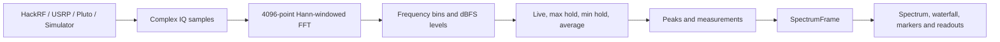

# SDR Frequency Analyzer

A desktop spectrum analyzer for receiving and displaying live RF signals with:

- HackRF One
- Ettus USRP devices supported by UHD
- ADALM-Pluto (PlutoSDR)
- A built-in IQ simulator for testing without hardware

The application continuously receives complex IQ samples from the selected
source, calculates an FFT, and displays a live spectrum and waterfall. Existing
analysis features include clear/write, max hold, min hold, averaging, peak
measurements, markers, delta markers, occupied bandwidth, and CSV export.

> **Current amplitude unit:** dBFS. Absolute dBm requires RF calibration for the
> specific SDR, frequency, gain, sample rate, and signal path. See
> [Amplitude: dBFS and dBm](#amplitude-dbfs-and-dbm).

## Contents

- [How the project works](#how-the-project-works)
- [Quick test without hardware](#quick-test-without-hardware)
- [Installation](#installation)
- [Running with an SDR](#running-with-an-sdr)
- [Using the interface](#using-the-interface)
- [Measurements](#measurements)
- [Amplitude: dBFS and dBm](#amplitude-dbfs-and-dbm)
- [Project structure](#project-structure)
- [Testing](#testing)
- [Troubleshooting](#troubleshooting)
- [RF safety](#rf-safety)

## How the project works

The same processing pipeline is used for physical SDRs and the simulator.
Simulator mode generates IQ samples; it does not generate a ready-made graph.



In simple terms:

1. `backend/acquisition.py` finds the selected SDR through SoapySDR and opens a
   continuous receive stream. Simulator mode creates two changing carriers and
   noise locally.
2. Acquisition runs on a background thread so the GUI stays responsive.
3. `backend/dsp.py` applies a Hann window and computes a 4096-point FFT. It
   converts FFT-bin magnitudes into dBFS and builds the frequency axis.
4. `backend/trace.py` updates the live, max-hold, min-hold, and average arrays.
5. `backend/measurements.py` and `backend/peak.py` calculate the measurement
   values. Peaks are used for analytics but are not drawn as colored triangles.
6. `backend/controller.py` packages everything into one `SpectrumFrame`.
7. Qt sends that frame to the spectrum renderer and waterfall in the frontend.

The default FFT size is 4096. The approximate resolution bandwidth is:

```text
RBW = sample rate / 4096
```

For example, at 20 Msps, the RBW is approximately 4.883 kHz.

## Quick test without hardware

Only Python, NumPy, PyQt6, and pyqtgraph are needed for simulator mode.

From the repository root:

```powershell
python run.py
```

Then:

1. Leave **SIMULATOR** selected.
2. Press **Run**.
3. Two carriers and a noise floor should appear.
4. Enable **Max Hold**, **Min Hold**, and **Average**. The traces should separate
   because the simulated carrier levels change over time.
5. Click the waveform to place a marker.
6. Enable **Delta** and drag the delta marker. It will remain snapped to the
   current waveform instead of moving freely.
7. Check the waterfall, measurements, screenshot, and CSV export.
8. Change center frequency, span, sample rate, or gain. The source is restarted
   with the new settings and trace history begins again.
9. Press **Stop** when finished.

## Installation

### Required Python and GUI packages

| Package | Used for |
|---|---|
| Python 3.10 or newer | Application runtime |
| NumPy | IQ arrays, FFT, traces, and measurements |
| PyQt6 | Desktop interface and thread-safe signals |
| pyqtgraph | Spectrum, waterfall, traces, and markers |

### Required SDR packages

| Package | Used for |
|---|---|
| SoapySDR with Python bindings | Common streaming and discovery interface |
| `soapysdr-module-hackrf` and `hackrf` | HackRF One |
| `soapysdr-module-uhd` and `uhd` | Ettus USRP |
| `soapysdr-module-plutosdr` and `libiio` | ADALM-Pluto |

The recommended environment is Radioconda. From a Radioconda Prompt:

```powershell
mamba install -c conda-forge -c ryanvolz numpy pyqt6 pyqtgraph soapysdr soapysdr-module-hackrf soapysdr-module-uhd soapysdr-module-plutosdr hackrf uhd libiio
```

Alternatively, create the supplied environment:

```powershell
mamba env create -f environment.yml
conda activate freqanalyzer
```

`requirements.txt` contains the Python-only packages. It is not sufficient for
physical SDRs because pip does not install all native device drivers and DLLs.

For Windows driver installation, UHD image setup, PATH configuration, and
offline ISRO deployment, read [INSTALL.md](INSTALL.md).

## Running with an SDR

Always start the program from an activated **Radioconda Prompt** in the project
root:

```powershell
cd C:\path\to\freqanalyzer
python run.py
```

Do not use `py main.py`. `py` may select a different Python installation, and
the application entry point is `run.py`.

### HackRF One

Verify the device before opening the application:

```powershell
hackrf_info
SoapySDRUtil --find="driver=hackrf"
```

Then:

1. Keep the signal-generator RF output off.
2. Connect the generator to the HackRF antenna SMA through suitable attenuation.
3. Run `python run.py`.
4. Select **HackRF**.
5. Set center frequency, span, sample rate, and a moderate starting gain.
6. Press **Run** and wait for the connected status.
7. Enable the signal generator at a safe low level.

Placing a CW tone slightly away from the exact center frequency is useful
because direct-conversion SDRs can show a DC artifact at the center bin.

### Ettus USRP

Before running the GUI:

```powershell
uhd_find_devices
uhd_usrp_probe
SoapySDRUtil --find="driver=uhd"
```

Run `uhd_images_downloader` during initial setup. USB USRPs require the correct
Windows USB driver. Network USRPs must be reachable on the configured network
interface and permitted by the local firewall.

Select **USRP** in the application and use a sample rate supported by that
device. The analyzer uses receive channel 0.

### ADALM-Pluto

Before running the GUI:

```powershell
iio_info -s
SoapySDRUtil --find="driver=plutosdr"
```

Select **PLUTO** and press **Run**. The Pluto USB/libiio driver must already be
installed. A network-connected Pluto must be reachable by libiio.

## Using the interface

### Device and receiver controls

| Control | Meaning |
|---|---|
| Device | Select Simulator, HackRF, USRP, or Pluto |
| Run / Stop | Open or close the continuous receive stream |
| Center | RF center frequency in Hz, kHz, MHz, or GHz |
| Span | Width of spectrum displayed around the center |
| SR | Hardware sample rate in mega-samples per second |
| Gain | Receiver gain requested through SoapySDR |

The displayed span cannot exceed the sample rate. If a smaller span is selected,
the backend crops the FFT bins around the center frequency. Changing a receiver
setting while running performs a controlled stream restart.

Different SDRs have different valid frequency, sample-rate, and gain ranges. A
device can reject an unsupported setting. The status bar displays the resulting
error rather than silently continuing.

### Traces

| Trace | Color | Behavior |
|---|---|---|
| Clear Write | Cyan | Most recent FFT frame |
| Max Hold | Red | Highest value reached by every frequency bin |
| Min Hold | Blue | Lowest value reached by every frequency bin |
| Average | Yellow | Running average of every frequency bin |

The trace history starts when acquisition starts and resets after the stream is
reconfigured or restarted. Multiple traces can be displayed at the same time.

### Markers

- Select marker M1, M2, or M3 and click the spectrum to place it.
- Edit a marker's **Freq** cell in the marker table to move it precisely. A plain
  number is interpreted as MHz; explicit `Hz`, `kHz`, `MHz`, and `GHz` suffixes
  are accepted. The marker snaps to the nearest displayed FFT bin.
- A normal marker snaps to the nearest FFT bin and follows that bin's live
  amplitude as new frames arrive.
- Delta mode creates a second marker relative to the selected normal marker.
- The delta marker also snaps to the existing live waveform while being dragged.
- Delta frequency and amplitude are shown relative to the parent marker.
- **Clear All** removes all normal and delta markers.
- Peak detection is still used for measurements and Peak Search, but automatic
  colored peak triangles are intentionally not displayed.

### Waterfall

The waterfall stores recent spectrum frames as rows. Frequency runs horizontally
and older frames move through the time axis. Color represents the dBFS level.

### Screenshot and CSV

- **Screenshot** saves an image of the application.
- **Export CSV** saves frequency, live amplitude, max hold, min hold, and average
  columns when those arrays are available.
- Exports default to `SpectrumAnalyzer_Exports` in the current user's home
  directory, but the file dialog allows another location.

### Keyboard shortcuts

| Shortcut | Action |
|---|---|
| Space | Run or stop acquisition |
| C | Toggle clear/write |
| Ctrl+H | Toggle max hold |
| Ctrl+L | Toggle min hold |
| Ctrl+G | Toggle average |
| Shift+M | Toggle delta marker |
| S | Screenshot |
| Ctrl+E | Export CSV |
| `+` / `-` | Zoom in / out |
| R | Reset zoom |
| Escape | Stop acquisition |

Right-clicking the spectrum also provides marker placement, marker clearing,
center-here, peak search, zoom, and screenshot actions.

## Measurements

The right-side measurement panel currently reports:

| Measurement | Current calculation |
|---|---|
| Peak Frequency | Frequency of the strongest live FFT bin |
| Peak Amplitude | Amplitude of that bin in dBFS |
| Noise Floor | Median amplitude of all displayed FFT bins |
| Occupied Bandwidth | Frequency interval containing the middle 99% of displayed spectral power: 0.5% to 99.5% cumulative power |
| Channel Power | Sum of linear power from every displayed FFT bin, converted back to dBFS |
| Carrier BW | Contiguous region around the strongest peak that remains at least 6 dB above the median noise floor |

Important interpretation notes:

- Noise floor is a per-bin value and changes with sample rate, FFT size, RBW,
  window, and receiver gain.
- Occupied bandwidth includes displayed noise. A weak signal can therefore
  produce a large occupied-bandwidth value.
- Channel power currently integrates the complete displayed span; there is no
  separately selected channel boundary.
- The GUI label `Carrier BW (Sub-Noise)` is historical. The implemented
  calculation is actually the strongest contiguous region above noise + 6 dB.

## Amplitude: dBFS and dBm

The SDR supplies normalized digital IQ values. Therefore, the backend can
directly calculate dBFS:

```text
0 dBFS = digital full scale / ADC clipping boundary
negative dBFS = below digital full scale
```

dBm is different: it is absolute RF power at a physical reference plane. Raw IQ
samples do not contain enough information to determine it universally. The
conversion changes with:

- SDR model and individual serial number
- center frequency
- receiver gain and internal gain stages
- sample rate and analog filtering
- selected RX connector and RF path
- cable and attenuator loss
- temperature and device variation

A calibrated conversion has the form:

```text
input power (dBm) = measured level (dBFS) + calibration offset (dB)
```

The offset must be measured using a known signal generator at the SDR input and
stored for the relevant frequency, gain, sample rate, and RF path. A single
fixed offset would only be an estimate and would not provide Keysight-class
accuracy. Simulator values cannot represent physical dBm because the simulator
has no RF connector.

Until calibration tables are added, changing the label from dBFS to dBm would
produce incorrect absolute readings. Frequency, bandwidth, relative level,
trace holds, averaging, and marker-delta measurements remain useful in dBFS.

## Project structure

```text
freqanalyzer/
|-- run.py                    Application entry point
|-- README.md                 Project overview and usage
|-- INSTALL.md                Detailed drivers and offline installation
|-- environment.yml           Complete Conda environment
|-- requirements.txt          Python-only requirements
|-- backend/
|   |-- acquisition.py        SoapySDR streaming and IQ simulator
|   |-- controller.py         IQ-to-SpectrumFrame processing pipeline
|   |-- dsp.py                Window, FFT, frequency axis, and dBFS
|   |-- trace.py              Live, max/min hold, and average traces
|   |-- peak.py               Peak detection
|   |-- measurements.py       Spectrum measurements
|   |-- models.py             Shared data structures
|   |-- main.py               Command-line SDR discovery diagnostic
|   |-- capture.py            Legacy HackRF file-capture helper
|   |-- iqreader.py           Legacy IQ-file reader
|   `-- plot.py               Legacy matplotlib plot helper
|-- frontend/
|   |-- gui.py                Main window, controls, status, and backend bridge
|   |-- renderer.py           Spectrum traces and marker behavior
|   |-- waterfall.py          Waterfall history display
|   |-- freq_control.py       Frequency/unit input widget
|   |-- marker_dropdown.py    M1/M2/M3 selector
|   `-- recorder.py           Screenshot and CSV export
`-- tests/
    |-- test_pipeline.py       DSP, tone, span, hold, and average tests
    `-- test_acquisition.py    Mock SDR and live simulator tests
```

`backend/main.py` is a discovery diagnostic, not the graphical application.
Run the graphical analyzer with `python run.py`.

## Testing

Run the automated tests without SDR hardware:

```powershell
python -m unittest discover -s tests -v
```

The tests verify:

- tone frequency and dBFS level
- max hold, min hold, and average accumulation
- display-span cropping and finite measurements
- mocked SoapySDR stream delivery and shutdown
- real-time simulator delivery through the normal analyzer pipeline

Run a syntax check with:

```powershell
python -m compileall backend frontend tests run.py
```

Passing software tests cannot prove USB drivers, RF input safety, device-specific
sample rates, or measurement calibration. Perform final acceptance with the
actual SDR and a safely attenuated known signal source.

## Troubleshooting

### The GUI opens but shows the simulator

Simulator is the default device. Select **HackRF**, **USRP**, or **PLUTO**, then
press **Run**.

### SoapySDR cannot be imported

Launch the program from a Radioconda Prompt and check:

```powershell
SoapySDRUtil --info
```

If Python or vendor executables are taken from another installation, correct
`PATH` so Radioconda's executables and DLLs are used together.

### No HackRF is detected

```powershell
hackrf_info
SoapySDRUtil --find="driver=hackrf"
```

Check the USB cable, Windows Device Manager, and WinUSB driver.

### No USRP is detected

```powershell
uhd_find_devices
uhd_usrp_probe
SoapySDRUtil --find="driver=uhd"
```

Check UHD images, USB drivers, or the network interface/subnet as appropriate.

### No Pluto is detected

```powershell
iio_info -s
SoapySDRUtil --find="driver=plutosdr"
```

Check the Analog Devices USB driver, libiio installation, cable, or network
connection.

### A large spike appears at the center

This can be a normal DC-offset artifact of a direct-conversion receiver. Test a
signal generator slightly away from the exact center frequency.

### The signal is missing or distorted

- Confirm center frequency and span include the source.
- Confirm the signal generator output is enabled.
- Check cables, connectors, and attenuation.
- Start with moderate receiver gain and adjust gradually.
- Excessive gain can create clipping, intermodulation products, and a raised
  noise floor.
- Never solve a weak display by applying unsafe RF power to the SDR input.

## RF safety

Use a known external attenuator between a signal generator and every SDR until
the complete RF level is understood. Check the manual for the exact SDR,
daughterboard, selected connector, and hardware revision.

For HackRF One, the documented maximum input is **-5 dBm**. Exceeding it can
permanently damage the receiver. Begin well below that level at the HackRF
connector and increase only when necessary.

Also verify that the cable uses the correct SMA connector and that the signal is
connected to the RF/antenna input—not a clock, trigger, or output connector.

## Current scope and limitations

- Receive-only spectrum analysis; the application does not transmit.
- One SDR and receive channel 0 at a time.
- Maximum GUI sample-rate selection is currently 20 Msps.
- FFT size is fixed at 4096.
- Span is limited to the selected sample rate; wide sweeps across multiple LO
  tunings are not implemented.
- Amplitude is dBFS until device-specific RF calibration is implemented.
- Channel power integrates the full displayed span.
- This is an SDR-based analyzer, not a replacement for a calibrated laboratory
  spectrum analyzer or power meter.

I am Krishna 